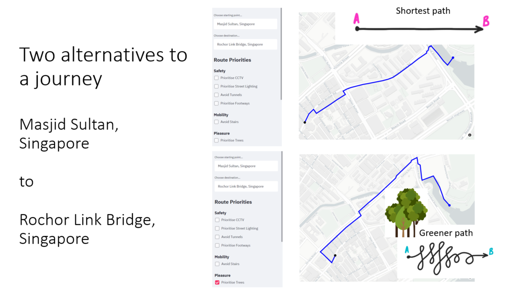
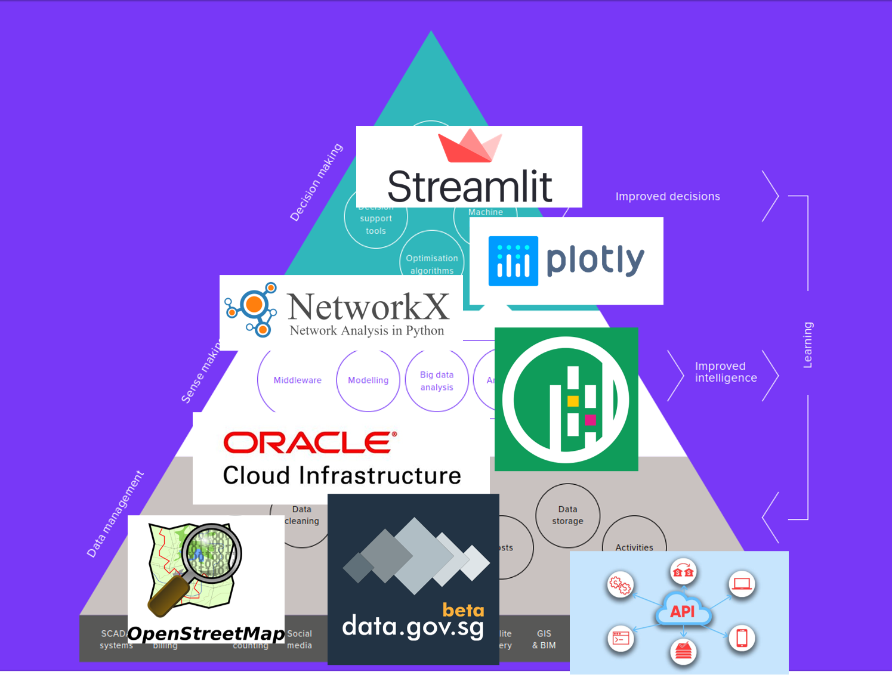

# MyWay


## Description

Mott MacDonald are delighted to present our #SmartCities Hackathon Solution “MyWay” which provides a safe solution for traversing the beautiful City of Singapore for pedestrians, improving mental health, and feeling of safety and security.

We are excited to be involved in the #SmartCities Hackathon: it strongly resonates with our purpose *to improve society by considering social outcomes in everything we do; relentlessly focusing on excellence and digital innovation, transforming our clients' businesses, our communities and employee opportunities*. We have assembled a truly, diverse, international team to take part in the Hackathon, spanning from June 4th to June 7th 2021    .


## Repository Ownership

* **Practice**: Cities
* **Sector**: Green Cities, Safety, Digital Twins
* **Original Author(s)**: the MM team
* **Contact Details for Current Repository Owner(s)**: luc.jonveaux@mottmac.com

# Solution

## Description

Today, the digital assistants helps users recommending the best path. **MyWay recommends the most enjoyable journey**, taking advantage of rapid-prototyping digital solutions on the front-end, but also tapping **Oracle OCI** to host a linux Virtual machine, supporting a streamlit-powered interface, as well as the MyWay engine. Data comes from the **Singapore open datasets**.

We also made use of the available street networks in Open Street Maps datasets, but a heavy rework of this dataset was required to improve the representation of the networks’ interconnectivity. For this prototype we have only included a portion of the Singapore road map network in order to reduce the amount of computational work required. 
The MyWay engine is building on top of existing path-finding algorithms available in the python Networkx package. We have combined the open data sets with the transport network by splitting the transport network into chunks no larger than 100m and then looking at the number of features of interest for each of those 100m chunks. We then update calculate an “effective distance” for each chunk of the network based on our features and users input preferences, making the length longer if it is undesirable and shorter if it is desirable. We then find the shortest path from the users start location to the end location using this “Effective distance” and display that to the user.



Later on, the app could build on earth observation data to feed in updated green spaces, as well as sentiment rating from social networks with tagged pictures to increase the relevance of observations.

The references to datasets, and precise overview of the actual code, are published and can be found on: https://github.com/mottmacdonaldglobal/SMARTCITIES-HACK-2021/
Behind the scenes, the MyWay engine is using a number of  datasets from Singapore open data portal ( https://data.gov.sg/ ), coupled with other open datasets.

## The stack



# Running the App

## Live Example

A live example is currently runnin on an Oracle Cloud VM at address:
http://158.101.211.30:8502/


## Installation Instructions

The recommended way to run this code will be to use a linux environment with conda, this has been tested on Ubuntu.

In order to successfully run the code in this respository, it is recommended that you create a virtual environment and install the required packages from the requirements.txt file provided. This can be done either through pip or conda Python package managers in the appropriate command line.

```
# For conda on 64 bit linux (Recommended)
> conda create --name venv python=3.8
> conda activate venv
> conda install --file environment.yml

```

## Notes on GDAL
A lot of the functionality in this app is based on the GDAL library.
Installing GDAL is relatively simple in certain popular Linux based environments such as Ubuntu.

```
#ubuntu commands
$ apt update
$ apt install -y gdal-bin python3-gdal python3-rtree
```

On windows you will need to install using this link
https://sandbox.idre.ucla.edu/sandbox/tutorials/installing-gdal-for-windows

## Running the Code

Clone the repository into a folder and activate the virtual environment or the conda environment.
Then run the following commands:

```
cd streamlit_app
streamlit run app.py
```

This will open the app on `localhost:8501 `. 

# Datasets Used

This project combines a number of open datasets. These are:

Dataset | Source Link
:---|:---
Master Plan 2019 Road layer|  https://data.gov.sg/dataset/master-plan-2019-road-name-layer 
Full pedestrian network from OSM | https://download.geofabrik.de/asia/malaysia-singapore-brunei.html 
CCTV | https://data.gov.sg/dataset/lta-road-camera 
Street Lighting | https://data.gov.sg/dataset/lta-lamp-post 
Trees | https://exploretrees.sg/ 
Parks | https://data.gov.sg/dataset/park-facilities

A heavy rework of the network dataset was required to improve the representation of the networks’ interconnectivity, tackled using ArcGIS tools.

Our solution uses a custom shapefile that integrates different layers merged over the center of Singapore downtown.  

# Good Test Sites

This is a table of useful addresses for testing the feature preferences of users.

Feature | Start Address | End Address
:---:|:---:|:---:
Avoid Stairs | The Landmark, Singapore | Smith Street, Singapore
Prioritise Trees| Masjid Sultan, Singapore | Rochor Link Bridge, Singapore
Prioritise Lighting| Masjid Sultan, Singapore | Rochor Link Bridge, Singapore

